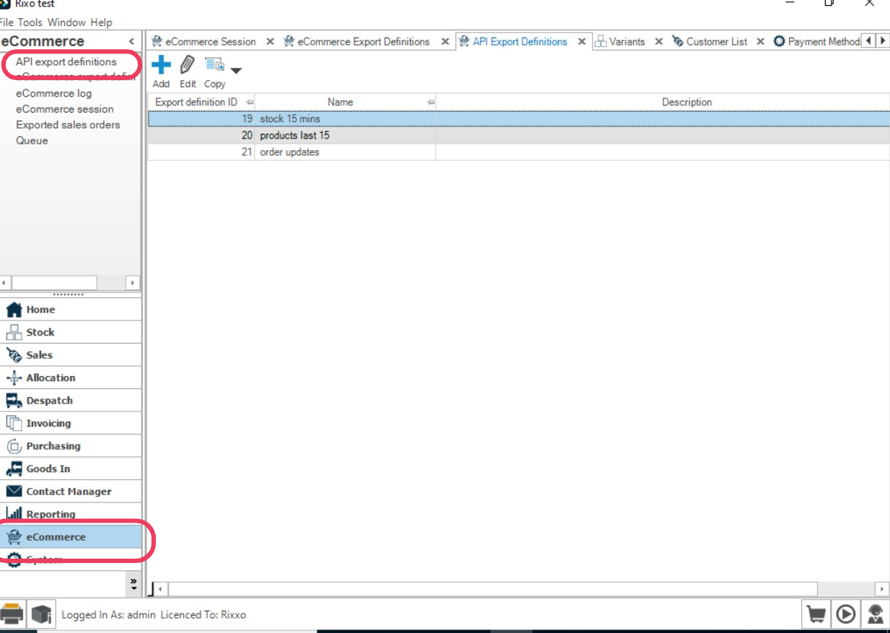
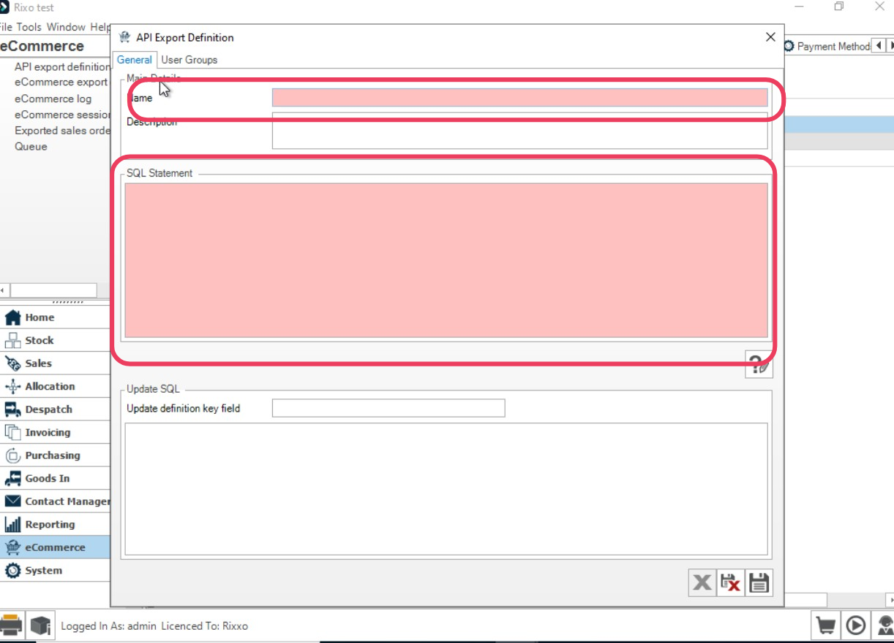
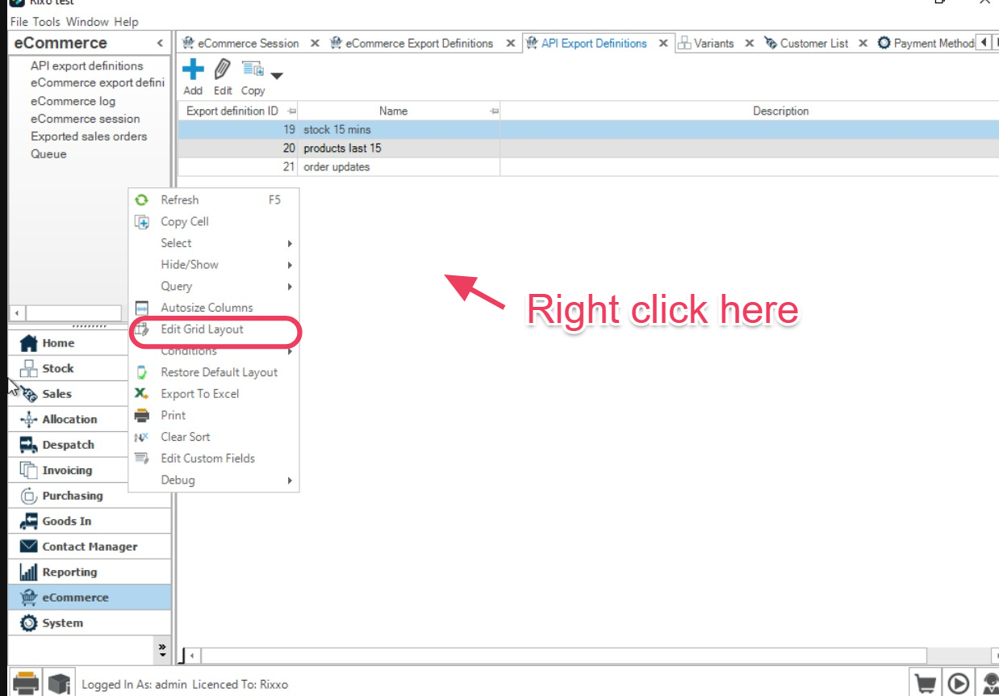
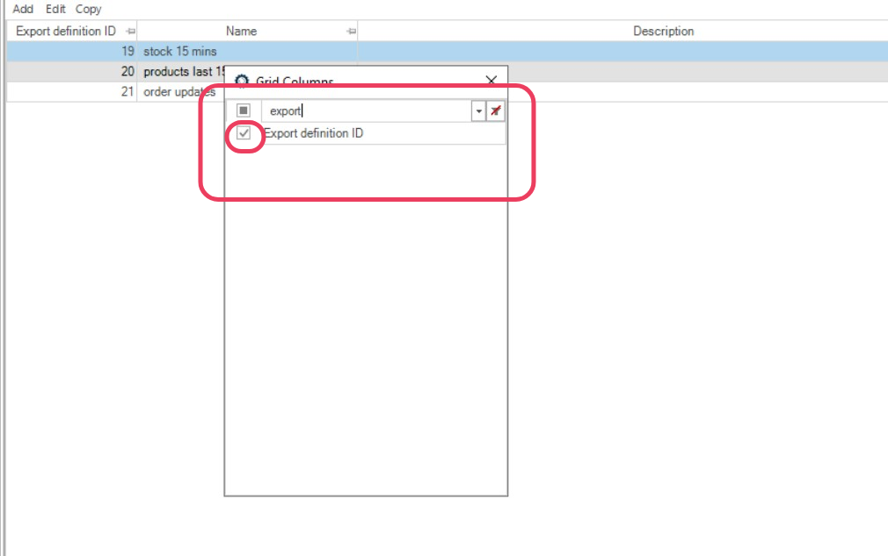
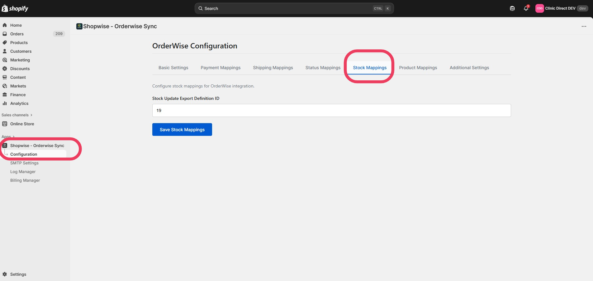

# Stock Updates (Inventory Sync)

Stock Updates keeps your Shopify stock levels synchronized with OrderWise. ShopWise reads export data from OrderWise containing each variant's SKU and free stock, then updates the matching Shopify variant.

## How It Works

- **Matching**: Shopify variants are matched by **SKU** (variant code)
- **Data Source**: OrderWise export definition provides SKU and free stock data
- **Update Frequency**: ShopWise checks for updates every 15 minutes
- **Sync Direction**: OrderWise → Shopify (one-way sync)
- **Optional**: Enable multi stock location in Stock Settings to sync and fulfil by mapped Shopify ↔ OrderWise locations

## Prerequisites

Before setting up stock updates, you need to create an OrderWise API Export Definition.

### Step 1: Create OrderWise API Export Definition

1. Open **OrderWise**
2. Click **E-Commerce** (bottom-left menu)
3. Click **API Export Definitions** (top-left menu)



4. Click **Add**
5. Name it clearly, e.g., **ShopWise Stock Sync**



6. In **SQL Statement**, copy the following:

```sql
-- Adjust the time window to suit. -15 = last 15 minutes, -1500 ≈ last 25 hours.
WITH DateCheck AS (
    SELECT DATEADD(MINUTE, -15, GETDATE()) AS DateWindowStart
)
SELECT
  variant_detail.vad_variant_code                 AS sku,        -- REQUIRED: used to match Shopify variants
  variant_stock_quantity.vasq_free_stock_quantity AS freeStock   -- Free/available stock to publish to Shopify
FROM variant_detail
INNER JOIN variant_stock_quantity
  ON variant_detail.vad_id = variant_stock_quantity.vasq_vad_id
CROSS JOIN DateCheck
WHERE
  vasq_stock_levels_last_calculated >= DateWindowStart;
```

### Step 2: Get the Export Definition ID

1. In **API Export Definitions**, right-click the grid and choose **Edit Grid Layout**



2. Add **Export Definition ID** to the grid



3. Save and note the **Export Definition ID** for your new export

## Configure in ShopWise

1. Open **ShopWise** in your Shopify admin
2. Go to **Configuration → Stock Mappings**
3. Enter the **Stock Export Definition ID** from OrderWise
4. If using multiple warehouses/locations, tick **multi stock location** in Stock Settings and map each Shopify location to its OrderWise stock location ID
5. Click **Save**



## Example Output

The export definition returns data in this format:

```json
{
  "sku": "ABC-100-RED",
  "freeStock": 23
}
```

## Multi Stock Locations

If you need stock levels per Shopify location (rather than a single combined free-stock figure), enable **multi stock location** in **ShopWise → Configuration → Stock Settings**.

When this option is ticked:

- You can map each Shopify location to an OrderWise stock location
- Stock sync updates **per SKU per location**
- A different export SQL must be used (the standard query above does not return location IDs)

### Finding OrderWise Stock Location IDs

1. In OrderWise go to **System → Global → Stock Locations**
2. Note the **Stock Location ID** for each warehouse/location you want to sync
3. Map each of those IDs to the matching Shopify location in ShopWise stock settings

Each OrderWise stock location used in the export must be mapped to the corresponding Shopify location ID in ShopWise.

### Multi Location Stock Export SQL

Create (or update) your stock API export definition with SQL that returns `sku`, `freeStock`, and `StocklocationId`.

Replace the location IDs in the `WHERE vsl.vsl_sl_id IN (...)` clause with the OrderWise stock location IDs you have mapped:

```sql
WITH DateCheck AS (
    SELECT DATEADD(Minute, -30, GETDATE()) AS DateLastThirty
),
ChangedVariants AS (
    SELECT
        vad.vad_id,
        vad.vad_variant_code AS sku
    FROM variant_detail AS vad
    JOIN variant_stock_quantity AS vsq
        ON vsq.vasq_vad_id = vad.vad_id
    CROSS JOIN DateCheck
    WHERE vsq.vasq_stock_levels_last_calculated >= DateCheck.DateLastThirty
),
BaseStock AS (
    SELECT
        c.vad_id,
        c.sku,
        CASE WHEN vsl.vsl_free_stock_quantity < 0 THEN 0
             ELSE FLOOR(vsl.vsl_free_stock_quantity) END AS freeStock,
        vsl.vsl_sl_id AS locationId
    FROM ChangedVariants AS c
    JOIN variant_stock_location AS vsl
        ON vsl.vsl_vad_id = c.vad_id
    WHERE vsl.vsl_sl_id IN (1, 5, 11, 18)  -- replace with mapped locations
),
AlternateStock AS (
    SELECT alt.vad_variant_code AS sku, b.freeStock, b.locationId
    FROM BaseStock AS b
    JOIN variant_alternate_item AS vai ON vai.vaai_vad_id = b.vad_id
    JOIN variant_detail AS alt ON alt.vad_id = vai.vaai_alt_vad_id

    UNION ALL

    SELECT alt.vad_variant_code AS sku, b.freeStock, b.locationId
    FROM BaseStock AS b
    JOIN variant_alternate_item AS vai ON vai.vaai_alt_vad_id = b.vad_id
    JOIN variant_detail AS alt ON alt.vad_id = vai.vaai_vad_id
)
SELECT sku, freeStock, locationId AS StocklocationId
FROM BaseStock
UNION ALL
SELECT sku, freeStock, locationId AS StocklocationId
FROM AlternateStock
ORDER BY sku, StocklocationId;
```

### Manufactured / Kit Stock SQL

If you sync manufactured (kit/BOM) stock across locations, use this export instead. Update the `Locations` CTE so each `sl_id` matches a mapped OrderWise stock location. Mark one location per build group as primary (`is_primary = 1`) — kit buildable quantity is published against the primary location.

```sql
WITH DateCheck AS (
    SELECT DATEADD(Minute, -10080, GETDATE()) AS DateCutOff
),
Locations AS (
    SELECT 1 AS sl_id, 1 AS build_group, 1 AS is_primary
    UNION ALL SELECT 5, 1, 0
    UNION ALL SELECT 12, 1, 0
),
BuildGroups AS (
    SELECT DISTINCT build_group FROM Locations
),
DirectChanges AS (
    SELECT vsq.vasq_vad_id AS vad_id
    FROM variant_stock_quantity AS vsq
    CROSS JOIN DateCheck
    WHERE vsq.vasq_stock_levels_last_calculated >= DateCheck.DateCutOff
),
KitChanges AS (
    SELECT DISTINCT vb.vb_vad_id AS vad_id
    FROM DirectChanges AS dc
    JOIN variant_bom_component AS vbc ON vbc.vbc_vad_id = dc.vad_id
    JOIN variant_bom AS vb ON vb.vb_id = vbc.vbc_vb_id AND vb.vb_active = 1
),
ChangedIds AS (
    SELECT vad_id FROM DirectChanges
    UNION
    SELECT vad_id FROM KitChanges
),
ChangedVariants AS (
    SELECT
        vad.vad_id,
        vad.vad_variant_code AS sku,
        vas.vas_kit_variant AS kitFlag
    FROM ChangedIds AS ci
    JOIN variant_detail AS vad ON vad.vad_id = ci.vad_id
    LEFT JOIN variant_setting AS vas ON vas.vas_vad_id = vad.vad_id
),
KitComponents AS (
    SELECT
        cv.vad_id AS kit_vad_id,
        vb.vb_id,
        vbc.vbc_vad_id AS comp_vad_id,
        vbc.vbc_quantity
    FROM ChangedVariants AS cv
    JOIN variant_bom AS vb
        ON vb.vb_vad_id = cv.vad_id
        AND vb.vb_active = 1
        AND (vb.vb_oli_id = 0 OR vb.vb_oli_id IS NULL)
        AND (vb.vb_pol_id = 0 OR vb.vb_pol_id IS NULL)
        AND (vb.vb_crli_id = 0 OR vb.vb_crli_id IS NULL)
    JOIN variant_bom_component AS vbc ON vbc.vbc_vb_id = vb.vb_id
    WHERE cv.kitFlag <> 0 OR cv.kitFlag IS NULL
),
ComponentFree AS (
    SELECT
        vsl.vsl_vad_id AS comp_vad_id,
        loc.build_group,
        SUM(vsl.vsl_free_stock_quantity) AS freeQty
    FROM variant_stock_location AS vsl
    JOIN Locations AS loc ON loc.sl_id = vsl.vsl_sl_id
    WHERE vsl.vsl_vad_id IN (SELECT comp_vad_id FROM KitComponents)
    GROUP BY vsl.vsl_vad_id, loc.build_group
),
BomBuildable AS (
    SELECT
        kc.kit_vad_id,
        kc.vb_id,
        bg.build_group,
        ROUND(MIN(ISNULL(cf.freeQty, 0) / NULLIF(kc.vbc_quantity, 0)), 0, 1) AS buildable
    FROM KitComponents AS kc
    CROSS JOIN BuildGroups AS bg
    LEFT JOIN ComponentFree AS cf
        ON cf.comp_vad_id = kc.comp_vad_id AND cf.build_group = bg.build_group
    GROUP BY kc.kit_vad_id, kc.vb_id, bg.build_group
),
KitBuildable AS (
    SELECT
        kit_vad_id,
        build_group,
        MAX(buildable) AS buildable
    FROM BomBuildable
    GROUP BY kit_vad_id, build_group
)
SELECT
    cv.sku,
    CASE
        WHEN cv.kitFlag = 0 THEN
            CASE WHEN ISNULL(vsl.vsl_free_stock_quantity, 0) < 0 THEN 0
                 ELSE FLOOR(ISNULL(vsl.vsl_free_stock_quantity, 0)) END
        WHEN loc.is_primary = 1 THEN
            CASE WHEN ISNULL(kb.buildable, 0) < 0 THEN 0
                 ELSE ISNULL(kb.buildable, 0) END
        ELSE 0
    END AS freeStock,
    loc.sl_id AS StocklocationId
FROM ChangedVariants AS cv
CROSS JOIN Locations AS loc
LEFT JOIN variant_stock_location AS vsl
    ON vsl.vsl_vad_id = cv.vad_id AND vsl.vsl_sl_id = loc.sl_id
LEFT JOIN KitBuildable AS kb
    ON kb.kit_vad_id = cv.vad_id AND kb.build_group = loc.build_group;
```

### Multi Location Example Output

```json
{
  "sku": "ABC-100-RED",
  "freeStock": 12,
  "StocklocationId": 1
}
```

Rows are returned **per SKU per stock location**. ShopWise uses `StocklocationId` with your location mappings to update the correct Shopify location.

### Order Fulfilment Across Locations

When multi stock location is enabled and an order line needs stock from more than one location, ShopWise splits that item into multiple line items — one per stock location. Each line item is sent with its own stock location and can have a different quantity.

## Important Notes

### Time Window Configuration
- **Default (standard stock)**: 15 minutes (matches ShopWise polling frequency)
- **Multi location example**: 30 minutes (`DATEADD(Minute, -30, GETDATE())`)
- **Manufactured stock example**: 7 days (`DATEADD(Minute, -10080, GETDATE())`) so kit component changes are picked up
- **For ~25 hours**: Use `DATEADD(MINUTE, -1500, GETDATE())`
- **Recommendation**: Keep the window at least as wide as your ShopWise poll interval to avoid missing updates

### Field Requirements
- **Standard stock**: do not change field names (`sku`, `freeStock`)
- **Multi stock location**: do not change field names (`sku`, `freeStock`, `StocklocationId`)
- **SKU must match exactly** (case-sensitive, including spaces)
- **freeStock**: Usually represents available/allocatable stock
- **StocklocationId**: Must match mapped OrderWise stock location IDs

### Performance Considerations
- Filter by changed rows only (as shown in SQL)
- Limit multi-location SQL to mapped warehouse IDs only
- Large datasets may require additional optimization

## Troubleshooting

### Common Issues

**SKU Mismatch**
- Ensure OrderWise `variant_code` exactly matches Shopify variant SKU
- Check for extra spaces, case differences, or special characters

**No Stock Updates**
- Verify Export Definition ID is correct
- Check that export returns data for recent changes
- Ensure time window includes recent stock changes

**Multi Location Not Updating**
- Confirm multi stock location is enabled in Stock Settings
- Verify every `StocklocationId` in the export is mapped to a Shopify location
- Confirm you are using multi-location SQL (not the standard single free-stock query)
- Check OrderWise location IDs under **System → Global → Stock Locations**

**Performance Issues**
- Consider filtering by product categories or warehouses
- Adjust time window based on your update frequency needs
- Monitor export performance in OrderWise

### Verification Steps

1. **Check Export Data**: Run the SQL query directly in OrderWise
2. **Verify SKUs**: Compare OrderWise variant codes with Shopify SKUs
3. **Monitor Logs**: Check ShopWise logs for sync errors
4. **Test Updates**: Make a stock change in OrderWise and verify Shopify updates
5. **Multi location**: Confirm stock changed at the expected Shopify location, not only the default location

## Next Steps

With stock updates configured:

1. **[Payment Mapping](payment-mapping.md)** - Set up payment method mapping
2. **[Shipping Mapping](shipping-mapping.md)** - Configure shipping method mapping
3. **[Status Mapping](status-mapping.md)** - Set up order status synchronization

---

**Stock sync working?** Proceed to [Payment Mapping](payment-mapping.md) to configure payment method mapping.
